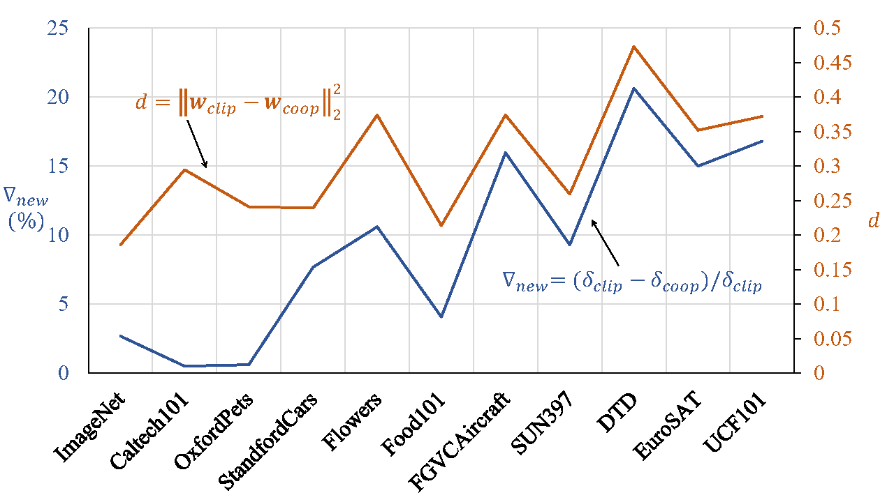

# Visual-Language Prompt Tuning with Knowledge-guided Context Optimization  [CVPR 2023]

> [**Visual-Language Prompt Tuning with Knowledge-guided Context Optimization**](https://arxiv.org/abs/2210.03117)<br>
> Hantao Yao, Rui Zhang, Changsheng Xu

## Highlights
We introduce a novel Knowledge-guided Context Optimization (KgCoOp) to enhance the generalization ability of the learnable prompt for unseen classes. The key insight of KgCoOp is that the forgetting about essential knowledge can be alleviated by reducing the discrepancy between the learnable prompt and the hand-crafted prompt. Especially, KgCoOp minimizes the discrepancy between the textual embeddings generated by learned prompt and the hand-crafted prompts. Extensive evaluation shows that KgCoOp is an efficient method, i.e., achieves better performance with less training time.


| Methods | Prompts | Base | New | H | Training-time|
|---------|---------|------|------|---|-------------|
| CLIP | hand-crafted | 69.34 | 74.22 | 71.70 | -|    
| CoOp | textual | 82.63 | 67.99 | 74.60 | 6ms/image|
| ProGrad | textual | 82.48 | 70.75 | 76.16 | 22ms/image|
| CoCoOp | textual+visual | 80.47 | 71.69 | 75.83 | 160ms/image|
| KgCoOp | textual | 80.73 | 73.6 | 77.0 | 6ms/image|

## Main Contributions
We found that the the degree of performance degradation on the New classes is consistent with the distance between the learnable textual embedding and the hand-crafted textual embedding, which is the core motivation of the KgCoOp.


## Running code
1. [Dassl.ProGrad.pytorch](Dassl.ProGrad.pytorch/) is the modified toolbox of [Dassl.pytorch](https://github.com/KaiyangZhou/Dassl.pytorch).
2. [KgCoOp](KgCoOp/). To get the results in our paper, follow the [README.md](KgCoOp/README.md) under [KgCoOp/](KgCoOp/) to set the environment.

## Citation
If you use our work, please consider citing:
```bibtex
@inproceedings{khattakMaPLe,
    title={Visual-Language Prompt Tuning with Knowledge-guided Context Optimization},
    author={Hantao Yao, Rui Zhang, Changsheng Xu},
    booktitle={The IEEE/CVF Conference on Computer Vision and Pattern Recognition},
    year={2023}
}
```


## Acknowledgements
Our code is based on [Co-CoOp and CoOp](https://github.com/KaiyangZhou/CoOp) and [ProGrad](https://github.com/BeierZhu/Prompt-align) repository. We thank the authors for releasing their code. If you use our model and code, please consider citing these works as well.
